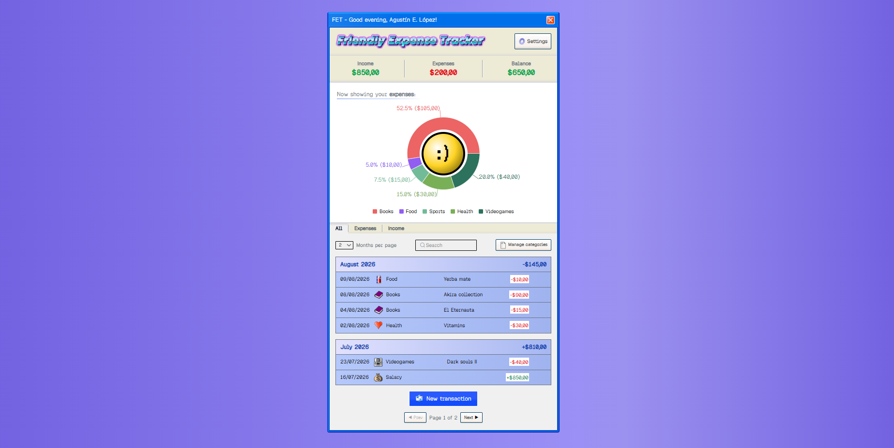

# Friendly Expense Tracker — Frontend

A React frontend for a personal finance tracker, with a deliberately playful late-90s/early-2000s aesthetic. Talks to the [Friendly Expense Tracker backend](https://github.com/agustin-lopez/friendly-expense-tracker-backend).

**Live demo:** https://friendly-expense-tracker-frontend.vercel.app

**BEFORE GIVING THE DEMO A TRY**: Please note that this demo is hosted on Render's free tier, which includes a cold start of ~1 minute after being inactive for 15 minutes.


**Backend repo:** https://github.com/agustin-lopez/friendly-expense-tracker-backend



---

## About this project

This started as a small portfolio project to learn React, and turned into a full production deployment I actually intend to keep running and using myself. Along the way it picked up a real authentication flow (with email verification and confirmation-based password changes), server-side pagination, a search feature, a customizable appearance system, and a retro-inspired UI I had a lot of fun building from scratch.

## Tech stack

- **React** + **Vite**
- **Tailwind CSS v4**
- **Recharts** for the summary pie chart
- **mathjs** for the in-form calculator
- **[react-old-icons](https://github.com/gsnoopy/react-old-icons)** for the retro icons collection
- **Vercel** for deployment

## Features

- Email/password auth with email verification, password recovery, and confirmation-based password changes (all via the backend's email flow)
- Dashboard with balance summary, an interactive pie chart (filterable by transaction type), and a paginated, month-grouped transaction list
- Transaction creation/editing with an inline calculator
- Category management (create/edit/delete) with a live-preview icon picker
- Debounced search across transaction description and category name
- Customizable background (image, flat color, or gradient) and currency symbol, persisted per-device
- Retro-styled reusable UI: window-style modals, custom tooltips that reposition themselves to stay on-screen
- Responsive down to ~360px wide
- Semantic HTML and ARIA roles on modals/dialogs and page regions

## Getting started locally

### Prerequisites
- Node.js 18.18+ (20+ recommended)
- [Backend](https://github.com/agustin-lopez/friendly-expense-tracker-backend) running locally, or pointed at a deployed instance

### Setup

```bash
git clone https://github.com/agustin-lopez/friendly-expense-tracker-frontend.git
cd friendly-expense-tracker-frontend
npm install
```

Create a `.env.local` file:
```
VITE_API_URL=http://localhost:8080/api
```

Run it:
```bash
npm run dev
```

## Known limitations

- **Cold starts**: the backend is hosted on Render's free tier, which spins down after periods of inactivity. The first request can take up to ~1 minute to come back — this is a hosting tradeoff, not a bug.
- **Email delivery**: account verification and password-related emails may not reach every address reliably, due to the backend's current email provider setup (see the backend README for details).

## License

MIT
